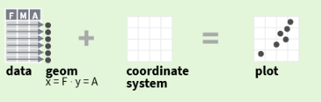
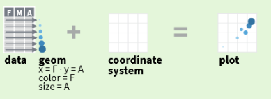
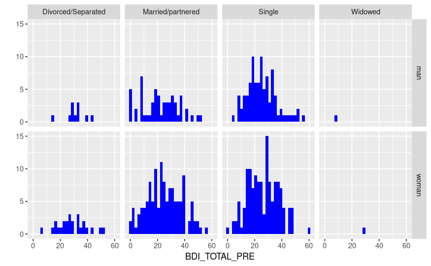
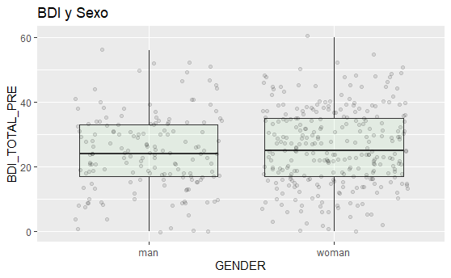
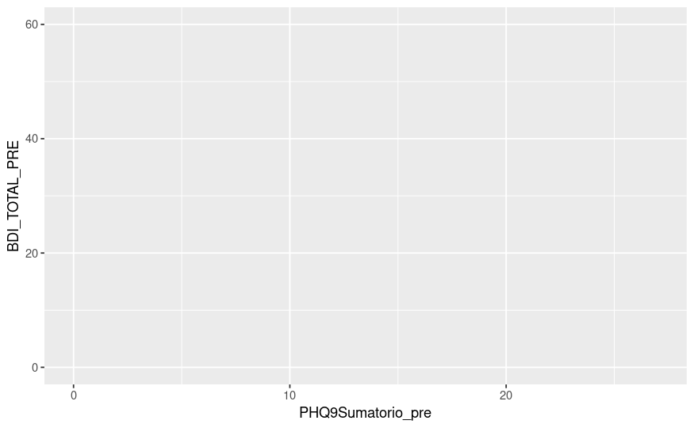
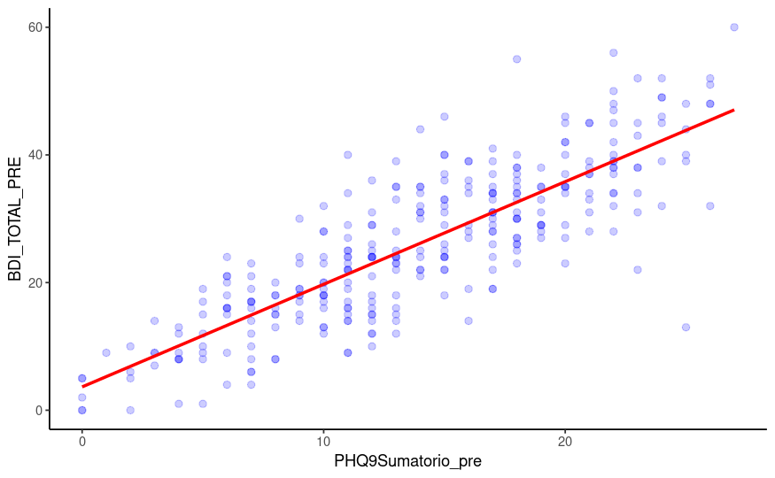
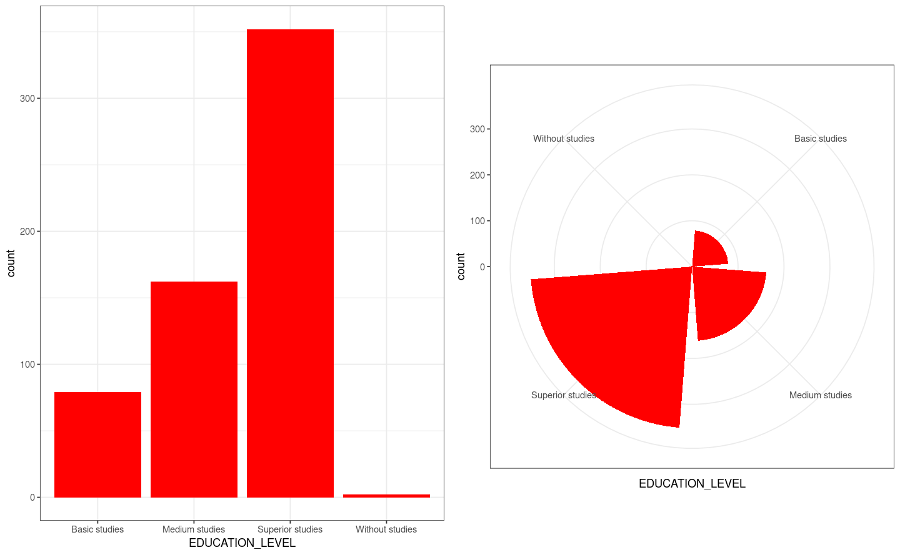
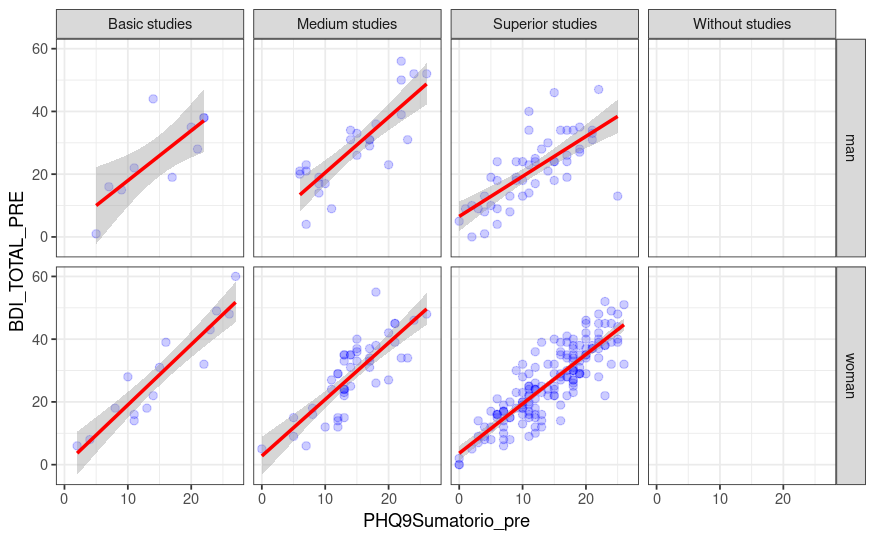
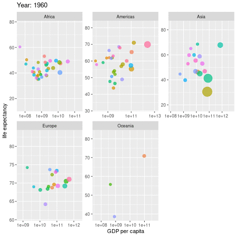

&nbsp;

```{r setup, include=FALSE}
library(learnr)
knitr::opts_chunk$set(echo = FALSE)
```

## Gráficos con R

Disponemos de funciones de alto nivel que producen gráficos completos (`plot()`,`boxplot()`,``hist()`...) y funciones de bajo nivel que añaden elementos a un gráfico ya creado (`lines()`,`points()`,`abline()`...).

### Ejercicio 1

Vamos a generar un gráfico de densidades del ancho de los sépalos para cada una de las especies de flores presentes en la base de datos `iris`.

```{r plot1ex, exercise=TRUE,exercise.blanks='___+'}
# Generamos tres submuestras
setosa <- iris$Sepal.Width[iris$Species==___]
versi <- iris$Sepal.Width[iris$Species==___]
virgi <- iris$Sepal.Width[iris$Species==___]

# Utilizamos una función de alto nivel plot() para setosa

plot(density(___),ylim=c(0,1.5),col=1,main="Sepal.width y Species")

# Añadimos las densidades de versicolor y virginica
lines(density(___),col=2)
lines(density(___),col=3)

# Añadimos elementos visuales en el eje x correspondiente a las observaciones
# en cada submuestra
rug(___,col=1)
rug(___,col=2)
rug(___,col=3)

# Añadimos una leyenda al gráfico
legend('topright',c('Setosa','Versicolor','Virginica'),col=c(1:3),lty=rep(1,3),bg='gray99')

```

```{r plot1ex-hint}
# Especifica los nombres de las submuestras en cada parte
```

```{r plot1ex-solution}
setosa <- iris$Sepal.Width[iris$Species=='setosa']
versi <- iris$Sepal.Width[iris$Species=='versicolor']
virgi <- iris$Sepal.Width[iris$Species=='virginica']

plot(density(setosa),ylim=c(0,1.5),col=1,main="Sepal.width y Species")

lines(density(versi),col=2)
lines(density(virgi),col=3)
rug(setosa,col=1)
rug(versi,col=2)
rug(virgi,col=3)
legend('topright',c('Setosa','Versicolor','Virginica'),col=c(1:3),lty=rep(1,3),bg='gray99')
```

R dispone además de dispositivos gráficos que permite la gestión de los objetos gŕaficos creados en la sesión de trabajo.

### Ejercicio 2

Vamos a generar 5 diagramas de dispersión con datos aleatorios (variables X e Y con 100 observaciones cada uno). Luego se guardarán como `gráfico1.png`, `gráfico2.png`, `gráfico3.png`, `gráfico4.png`y `gráfico5.png`.

```{r plot2ex, exercise=TRUE,exercise.blanks='___+',fig.width=9,fig.height=9}
for(i in 1:5) {
  png(file=paste0(___,i,___))
  X <- rnorm(___)
  Y <- rnorm(___)
  plot(___,___, main= 'Diagrama de puntos', 
		xlab='', ylab='',pch=16)
  abline(lm(___~___),col='green')
  dev.off()
  }
```

```{r plot2ex-hint}
# Nombra los archivos a generar con el dispositivo png()
# Especifica tamaño de muestras
# Especifica variables en funciones gráficas
```

```{r plot2ex-solution}
for(i in 1:5) {
  png(file=paste0('grafico',i,'.png'))
  X <- rnorm(100)
  Y <- rnorm(100)
  plot(X,Y, main= 'Diagrama de puntos', 
        xlab='', ylab='',pch=16)
  abline(lm(Y~X),col='green')
  dev.off()
}
for(i in 1:5)
plot(magick::image_read(list.files()[stringr::str_detect(list.files(),'.png')][i]))

```

### Ejercicio 3

Los objetos fórmula son de gran utilidad a la hora de generar gráficos multivariantes. La instalación básica de R incluye algunas funciones predefinidas como `boxplot()` que aceptan como argumento de entrada objetos de tipo fórmula. Realiza un diagrama de cajas agrupadas con los datos `ToothGrowth` en el que la variable de respuesta `len` se representará gráficamente para cada nivel de dosis (variable `dose`) y de tipo de suplemento (`supp`).

```{r bpex, exercise=TRUE, exercise.blanks='___+',fig.width=9,fig.heigth=9}
boxplot(___ ~ ___:___, data = ___, boxwex = 0.5,col = c("orange","yellow"),
main = "Crecimiento dental en cobayas",
xlab = "Vitamina C (mg)", ylab = "Longitud", sep = ":")
```

```{r bpex-hint}
# Añade las variables y el nombre de la base de datos
```

```{r bpex-solution}
boxplot(len ~ dose:supp, data = ToothGrowth, boxwex = 0.5,col = c("orange","yellow"),
main = "Crecimiento dental en cobayas",
xlab = "Vitamina C (mg)", ylab = "Longitud", sep = ":")
```

### Ejercicio 4

Los parámetros gráficos en la instalación básica de R con la función `par()` nos permiten configurar el comportamiento de las funciones gráficas en una gran cantidad de aspectos. ¿Cuántos parámetros gráficos hay?
Inspecciona los valores por defecto para el color y el tipo de línea; cámbialos por rojo y línea discontinua.


```{r parex, exercise=TRUE,exercise.blanks='___+'}
length(par())

par(___,___) # Qué color y tipo de línea? #    
     
par(col=___,lty=___)
```

```{r parex-hint}
# Los parámetros gráficos suelen ser cadenas o valores numéricos
```


```{r parex-solution}
length(par())

par('col','lty') # Qué color y tipo de línea? #    
     
par(col='red',lty='dashed')
```

### Ejercicio 5

Representa distintos tipos de líneas mediante la función `plot()` de R. Concretamente, representa en una sola ventana gráfica un gráfico de lineas continuas, discontinua con lineas, con puntos, con puntos y líneas, con dos líneas y con líneas largas.

```{r tipex, exercise=TRUE, exercise.blanks='___+',fig.height=10.5,fig.width=10.5,message=FALSE,warning=FALSE}
set.seed(123)
y <- rnorm(20)
par(mfrow=c(3,2))
plot(y,type=___, lty=___); plot(y,type=___, lty=___)
plot(y,type=___, lty=___); plot(y,type=___, lty=___)
plot(y,type=___, lty=___); plot(y,type=___, lty=___)
```

```{r tipex-hint}
# El argumento type acepta distintos tipos de elementos gráficos
# Consulta la ayuda de par() para saber los tipos de líneas
```

```{r tipex-solution}
set.seed(123)
y <- rnorm(20)
par(mfrow=c(3,2))
plot(y,type='l', lty='solid'); plot(y,type='l', lty='dashed')
plot(y,type='l', lty='dotted'); plot(y,type='l', lty='dotdash')
plot(y,type='l', lty='twodash'); plot(y,type='l', lty='longdash')
```

### Ejercicio 6

Representa distintos tipos de símbolos mediante la función `plot()` de R. Concretamente, representa en una sola ventana gráfica un gráfico de círculos, triángulos, cruces y asteriscos.

```{r simbex, exercise=TRUE, exercise.blanks='___+',fig.height=10.5,fig.width=10.5,message=FALSE,warning=FALSE}
set.seed(123)
y <- rnorm(20)
par(mfrow=c(2,2))
plot(y,type=___, pch=___); plot(y,type=___, pch=___)
plot(y,type=___, pch=___); plot(y,type=___, pch=___)
```

```{r simbex-hint}
# El argumento type acepta distintos tipos de elementos gráficos
# Consulta la ayuda de par() para saber los tipos de símbolos
```

```{r simbex-solution}
set.seed(123)
y <- rnorm(20)
par(mfrow=c(2,2))
plot(y,type='p', pch=1); plot(y,type='p', pch=2)
plot(y,type='p', pch=3); plot(y,type='p', pch=8)
```

Sobre la combinación de gráficos en una misma ventana, también se puede utilizar la función _layout_:

```{r layoutex, exercise=TRUE, warning=FALSE, message=FALSE, fig.width=8, fig.height=9,exercise.setup='exqplotsetup'}
layout(matrix(c(1,2)),heights=c(1.5,1))
layout.show(2)
```

```{r layoutex2, exercise=TRUE, warning=FALSE, message=FALSE, fig.width=8, fig.height=9}
layout(matrix(c(1,2)),heights=c(1.5,1))
x<-rnorm(10)     
hist(x)
plot(x,type='l')
```

### Ejercicio 7

* R incorpora una cantidad ingente de paletas tanto en la versión básica como en paquetes adicionales (por ejemplo, https://github.com/johnmackintosh/metallicaRt). Las paletas suelene aceptar uno o varios tipos de argumentos de entrada para especificar el color: cadenas de caracteres, valores numéricos, código hexadecimal...

```{r paletaex, exercise=TRUE, fig.height=10.5,fig.width=10.5,message=FALSE,warning=FALSE}
palette()
plot(1:8, 1:8, col=1:8, pch=19, cex=3, xlab="", ylab="")     
```

```{r paletaex-hint}
# Observa distintos tipos de codificaciones de colores en palette()
# El gráfico representa 8 colores distintos
```

### Ejercicio 8

Utiliza cuatro de las 4 paletas básicas en R para representar gráficamente un vector numérico de 15 valores.

```{r paletaex2, exercise=TRUE,exercise.blanks='___+'}
temp=1:15

par(mfrow=c(2,2))
barplot(temp, col=rainbow(___), main="rainbow")
barplot(temp, col=heat.colors(___), main="heat.colors")
barplot(temp, col=terrain.colors(___), main="terrain.colors")
barplot(temp, col=topo.colors(___), main="topo.colors")
```

```{r paletaex2-hint}
# Especifica el valor numérico adecuado dentro de cada argumento col
```

```{r paletaex2-solution}
temp=1:15
par(mfrow=c(2,2))
barplot(temp, col=rainbow(15), main="rainbow")
barplot(temp, col=heat.colors(15), main="heat.colors")
barplot(temp, col=terrain.colors(15), main="terrain.colors")
barplot(temp, col=topo.colors(15), main="topo.colors")
```

### Ejercicio 9

Utilizaremos ahora un ejemplo de Murrell (2006) para ver cómo se puede anotar un gráfico paso a paso.

```{r anotex1, exercise=TRUE}
x <- 1:10 
set.seed(123)
y <- matrix(sort(rnorm(30)), ncol=3)
plot(x, y[,1], ylim=range(y), ann=FALSE, axes=FALSE,type="l", col="grey")

```

```{r anotex2, exercise=TRUE,exercise.setup='anotex1'}
x <- 1:10 
set.seed(123)
y <- matrix(sort(rnorm(30)), ncol=3)
plot(x, y[,1], ylim=range(y), ann=FALSE, axes=FALSE,type="l", col="grey")

box(col="grey") # Crear ejes #    

```

```{r anotex3, exercise=TRUE,exercise.setup='anotex2'}
x <- 1:10 
set.seed(123)
y <- matrix(sort(rnorm(30)), ncol=3)
plot(x, y[,1], ylim=range(y), ann=FALSE, axes=FALSE,type="l", col="grey")
box(col="grey")

points(x, y[,1]) # Representar puntos # 

```

```{r anotex4, exercise=TRUE,exercise.setup='anotex3'}
x <- 1:10 
set.seed(123)
y <- matrix(sort(rnorm(30)), ncol=3)
plot(x, y[,1], ylim=range(y), ann=FALSE, axes=FALSE,type="l", col="grey")
box(col="grey")
points(x, y[,1]) 

lines(x, y[,2], col="grey") # Representar una segunda línea #
points(x, y[,2], pch=2) # Añadir puntos en la segunda línea #

```

```{r anotex5, exercise=TRUE,exercise.setup='anotex4'}
x <- 1:10 
set.seed(123)
y <- matrix(sort(rnorm(30)), ncol=3)
plot(x, y[,1], ylim=range(y), ann=FALSE, axes=FALSE,type="l", col="grey")
box(col="grey")
points(x, y[,1]) 
lines(x, y[,2], col="grey")
points(x, y[,2], pch=2)

lines(x, y[,3], col="grey") # Representar una tercera línea #
points(x, y[,3], pch=3) # Representar cruces en la tercera línea # 

```

```{r anotex6, exercise=TRUE,exercise.setup='anotex5'}
x <- 1:10 
set.seed(123)
y <- matrix(sort(rnorm(30)), ncol=3)
plot(x, y[,1], ylim=range(y), ann=FALSE, axes=FALSE,type="l", col="grey")
box(col="grey")
points(x, y[,1]) 
lines(x, y[,2], col="grey")
points(x, y[,2], pch=2)
lines(x, y[,3], col="grey")
points(x, y[,3], pch=3)

title('puntos() & lineas()') # Añadir título #

```

### Ejercicio 10

Podemos modificar la posición de las anotaciones que incorporemos en los gráficos de R. Una forma básica de anotar un gráfico es mediante la función `text()`.

```{r anotex7, exercise=TRUE, fig.height=9,fig.width=9,message=FALSE,warning=FALSE}
x <- c(4, 5, 2, 1)
y <- x
plot(x, y, ann=FALSE, axes=FALSE, col="grey", pch=16) # Parámetro pch=16 representa puntos #
points(3, 3, col="grey", pch=16) # Equivalente pero es una función de bajo nivel --> Requiere plot() previamente #
box(col="grey")
text(x,y,c('abajo','izqda','arriba','drcha'),pos=1:4) # Parámetro pos=1:4 #
text(3,3,'overlay') # Posición superpuesta por defecto #
title('text()')
```

### Ejercicio 11

Una forma más avanzada de anotación es la superposición de output.


```{r anotex8, exercise=TRUE,fig.height=9,fig.width=9,message=FALSE,warning=FALSE}
with(ToothGrowth,
{
  boxplot(len ~ supp, border="grey",
          col="light grey", boxwex=0.5)
  points(jitter(rep(1:2, each=30), 0.5),
         unlist(split(len, supp)),
         cex=0.5, pch=16)
})  
```

### Ejercicio 12

Podemos anotar los gráficos con símbolos, fórmulas y expresiones matemáticas. 

```{r anotex9, exercise=TRUE,fig.height=9,fig.width=9,message=FALSE,warning=FALSE}
set.seed(123)
x <- rnorm(100)
y <- rnorm(100)
mylm <- lm(y~x) # Regresión lineal 
plot(x,y) # Representar diagrama de puntos
abline(mylm,col='red') # Dibujar línea MCO
b0 <- round(mylm$coefficients[1],2) # Intercepto
b1 <- round(mylm$coefficients[2],2) # Pendiente
title(main=expression(paste('X,Y~N(',mu,',',sigma,')')))
legend('topright',legend = substitute(
    paste(hat(beta)[0], "=",beta0, ", ", hat(beta)[1], "=",beta1),
    list(beta0 = b0, beta1 = b1)),bty='n')
```

Equivalentemente mediante el paquete `latex2exp`:

```{r anotex10, exercise=TRUE,fig.height=9,fig.width=9,message=FALSE,warning=FALSE}
library(latex2exp)
set.seed(123)
x <- rnorm(100)
y <- rnorm(100)
mylm <- lm(y~x) # Regresión lineal 
plot(x,y) # Representar diagrama de puntos
abline(mylm,col='red') # Dibujar línea MCO
b0 <- round(mylm$coefficients[1],2) # Intercepto
b1 <- round(mylm$coefficients[2],2) # Pendiente
title(main=TeX('$X,Y\\sim N(\\mu,\\sigma)$'))
legend('topright',legend = TeX(paste0('$\\hat{\\beta}_0=',b0,', \\hat{\\beta}_1=',b1,'$')),bty='n')
```


## El paquete ggplot2

`ggplot2` (Wickham, 2016) es una implementación en R de la llamada gramática de los gráficos. Se puede instalar solo o con `tidyverse`. En el siguiente [enlace](https://github.com/rstudio/cheatsheets/blob/main/data-visualization-2.1.pdf) se encuentra una tabla con sus principales funcionalidades. En su forma básica se requieren unos datos, un sistema de coordenadas y unos elementos geométricos para representar un gráfico.

```{r, echo=FALSE, out.width="100%",out.height="100%"}

```

Para representar los valores de las variables y visualizar los datos mediante elementos gráficos se usan los **aesthetics**: color, tamaño, coordenadas (x,y). Se trata de crear un lienzo vacío en el que disponer todos los elementos que posibiliten una buena visualización de los datos.

```{r, echo=FALSE, out.width="100%",out.height="100%"}

```

Hay una función muy similar a la función en la instalación básica de R `plot()`: `qplot()`. Permite crear distintos tipos de gráficos rápida y fácilmente aunque es menos flexible que la función `ggplot()`. La función `qplot()` tiene el formato siguiente:

<pre style="color:blue;font-size:130%"> qplot(x, y=NULL, data, geom="auto", xlim = c(NA, NA), ylim =c(NA, NA))</pre>

### Ejercicio 1

Realiza el siguiente gráfico con la función `qplot()` (NOTA: la base de datos se llama `PANAS`):

```{r, echo=FALSE, out.width="100%",out.height="100%"}
knitr::include_graphics("images/qplot1.png")
```

```{r exqplotsetup}
library(haven)
library(ggplot2)

PANAS <- read_sav('data/Database_PANAS.sav')

PANAS$GENDER <- car::recode(as.integer(PANAS$GENDER),paste(paste0(c("1='","2='"),names(attr(PANAS$GENDER,"labels")),"'"),collapse='; '),as.factor = TRUE)

PANAS$CIVIL_STATUS <- car::recode(as.integer(PANAS$CIVIL_STATUS),paste(paste0(c("1='","2='","3='","4='"),names(attr(PANAS$CIVIL_STATUS,"labels")),"'"),collapse='; '),as.factor = TRUE)

PANAS$EDUCATION_LEVEL <- car::recode(as.integer(PANAS$EDUCATION_LEVEL),paste(paste0(c("0='","1='","2='","3='"),names(attr(PANAS$EDUCATION_LEVEL,"labels")),"'"),collapse='; '),as.factor = TRUE)
```


```{r qplot,exercise=TRUE,exercise.setup='exqplotsetup',exercise.blanks='___+',warning=FALSE,message=FALSE}
qplot(x=___,
      y=___,
      geom=c(___,___),
      color=___,data=___)

```

```{r qplot-hint}
# Especifica las variables y la base de datos en su apartado
# Especifica los geoms adecuados
```

```{r qplot-solution}
qplot(x=PHQ9Sumatorio_pre,
      y=BDI_TOTAL_PRE,
      geom=c('point','smooth'),
      color=GENDER,data=PANAS)

```

### Ejercicio 2

Realiza el siguiente gráfico con la función `qplot()`:

```{r, echo=FALSE, out.width="100%",out.height="100%"}

```

```{r qplot2,exercise=TRUE,exercise.setup='exqplotsetup',exercise.blanks='___+',warning=FALSE,message=FALSE}
qplot(x=____,
      geom=c(___),fill=I(___),
      data=___,facets=___)

```

```{r qplot2-hint}
# Especifica las variables y la base de datos en su apartado
# Especifica los geoms adecuados
```

```{r qplot2-solution}
qplot(x=BDI_TOTAL_PRE,
      geom=c('histogram'),fill=I('blue'),
      data=PANAS,facets=GENDER~CIVIL_STATUS)

```

### Ejercicio 3

Realiza el siguiente gráfico con la función `qplot()`:

```{r, echo=FALSE, out.width="100%",out.height="100%"}

```

```{r qplot3,exercise=TRUE,exercise.setup='exqplotsetup',exercise.blanks='___+',warning=FALSE,message=FALSE}
qplot(___,___,
      data=___,
      geom=c(___,___),
      fill=I(___),alpha=I(.1),
      main='BDI y Sexo')

```

```{r qplot3-hint}
# Especifica las variables y la base de datos en su apartado
# Especifica los geoms adecuados
```

```{r qplot3-solution}
qplot(GENDER,BDI_TOTAL_PRE,
      data=PANAS,
      geom=c('boxplot','jitter'),
      fill=I('lightgreen'),alpha=I(.1),
      main='BDI y Sexo')

```

### 

La forma habitual de usar el paquete es con la función `ggplot()`. La llamada general a la función requiere especificar la base de datos, las variables a usar y los elementos geométricos/gráficos:

<pre style="color:blue;font-size:130%"> ggplot(data = &lt;DATA&gt) +
   &lt;GEOM_FUNCTION&gt(mapping = aes(&lt;MAPPINGS&gt))</pre>

### Ejercicio 1

Realiza el siguiente gráfico con la función `ggplot()`:

```{r, echo=FALSE, out.width="100%",out.height="100%"}

```

```{r ggplotex1,exercise=TRUE,exercise.setup='exqplotsetup',exercise.blanks='___+',warning=FALSE,message=FALSE}
ggplot(___,aes(x=___,y=___))

```

```{r ggplotex1-hint}
# Especifica las variables y la base de datos en su apartado
```

```{r ggplotex1-solution}
ggplot(PANAS,aes(x=PHQ9Sumatorio_pre,y=BDI_TOTAL_PRE))

```

### Ejercicio 2

Declarados datos y variables en el entorno `aes()`, podemos añadir elementos geométricos como líneas, puntos y curvas de densidad: `geom_line()`, `geom_point()` y `geom_density()`…

Realiza el siguiente gráfico con la función `ggplot()`:

```{r, echo=FALSE, out.width="100%",out.height="100%"}
knitr::include_graphics("images/ggplot2ex2.png")
```

```{r ggplotex2,exercise=TRUE,exercise.setup='exqplotsetup',exercise.blanks='___+',warning=FALSE,message=FALSE}
ggplot(___,aes(x=___,y=___)) +
  geom_point(size=2,color=___,alpha=.2) +
  theme_classic()

```

```{r ggplotex2-hint}
# Especifica las variables y la base de datos en su apartado
# Especifica el color de los puntos
```

```{r ggplotex2-solution}
ggplot(PANAS,aes(x=PHQ9Sumatorio_pre,y=BDI_TOTAL_PRE)) +
  geom_point(size=2,color='blue',alpha=.2) +
  theme_classic()
```

### Ejercicio 3

El paquete `ggplot2` tiene procedimientos estadísticos implementados para obtener distribuciones de frecuencias, análisis exploratorio y ajustes lineales y no lineales, entre otros: `geom_bar()`, `geom_smooth()`, `stat_summary()`, etcétera…

Realiza el siguiente gráfico con la función `ggplot()`:

```{r, echo=FALSE, out.width="100%",out.height="100%"}

```

```{r ggplotex3,exercise=TRUE,exercise.setup='exqplotsetup',exercise.blanks='___+',warning=FALSE,message=FALSE}
ggplot(___,aes(x=___,y=___)) +
  geom_point(size=2,color=___,alpha=.2) +
  geom_smooth(method=___,color=___,se=FALSE) +
  theme_classic()

```

```{r ggplotex3-hint}
# Especifica las variables y la base de datos en su apartado
# Especifica el color de los puntos y la recta ajustada
# El método lm genera un ajuste lineal
```

```{r ggplotex3-solution}
ggplot(PANAS,aes(x=PHQ9Sumatorio_pre,y=BDI_TOTAL_PRE)) +
  geom_point(size=2,color='blue',alpha=.2) +
  geom_smooth(method='lm',color='red',se=FALSE) +
  theme_classic()

```

### Ejercicio 4

Para practicar la especificación de colores manualmente en ggplot2, vamos a generar un gráfico de barras agrupadas para nivel educativo y fase de detección de la enfermedad. Utilizaremos los colores "#00AFBB", "#E7B800" y "#FC4E07" y tamaño de fuente del texto 20:

```{r ggplotex4,exercise=TRUE,warning=FALSE,message=FALSE,exercise.setup='exqplotsetup',exercise.blanks='___+'}
datKendall <- read_sav("data/ExCor3.sav")

datKendall$education <- as_factor(datKendall$education)
datKendall$phase <- as_factor(datKendall$phase)

df <- datKendall %>%
  group_by(education, phase) %>%
  summarise(counts = n()) 

p <- ggplot(df, aes(x = phase, y = counts)) +
  geom_bar(
    aes(color = education, fill = education),
    stat = "identity", position = position_dodge(0.8),
    width = 0.7
    ) +
  scale_color_manual(values = c(___,___,___))+
  scale_fill_manual(values = c(___,___,___)) + theme_bw()
p+theme(axis.text.x = element_text(size = ___),
        axis.text.y = element_text(size = ___),
        axis.title.x = element_text(size = ___),
        axis.title.y = element_text(size = ___),
        legend.text=element_text(size= ___),
        legend.title=element_text(size= ___),
        legend.position.inside = c(.2, .8))

```


```{r ggplotex4-hint}
# Especifica las variables y la base de datos en su apartado
# Especifica el vector de colores HEX en las funciones scale_color_fill y scale_fill_manual
# Especifica los tamaños de letra 20 en todos los argumentos size
```

```{r ggplotex4-solution}
datKendall <- read_sav("data/ExCor3.sav")

datKendall$education <- as_factor(datKendall$education)
datKendall$phase <- as_factor(datKendall$phase)

df <- datKendall %>%
  group_by(education, phase) %>%
  summarise(counts = n()) 

p <- ggplot(df, aes(x = phase, y = counts)) +
  geom_bar(
    aes(color = education, fill = education),
    stat = "identity", position = position_dodge(0.8),
    width = 0.7
    ) +
  scale_color_manual(values = c("#00AFBB", "#E7B800", "#FC4E07"))+
  scale_fill_manual(values = c("#00AFBB", "#E7B800", "#FC4E07")) + theme_bw()
p+theme(axis.text.x = element_text(size = 20),
        axis.text.y = element_text(size = 20),
        axis.title.x = element_text(size = 20),
        axis.title.y = element_text(size = 20),
        legend.text=element_text(size= 20),
        legend.title=element_text(size= 20),
        legend.position.inside = c(.2, .8))
```

### Ejercicio 5

`coord_XXX()` permite usar distintos sistemas de coordenadas (cartesianas, polares, mapas, transformadas...)

Realiza el siguiente gráfico con la función `ggplot()`:

```{r, echo=FALSE, out.width="100%",out.height="100%"}

```

```{r ggplotex5,exercise=TRUE,exercise.setup='exqplotsetup',exercise.blanks='___+',warning=FALSE,message=FALSE}
library(gridExtra)

p1 <- ggplot(___,aes(x=___)) +
  geom_bar(fill=___) +
  theme_bw()

p2 <- ggplot(___,aes(x=___)) +
  geom_bar(fill=___) +
  coord_polar() + 
  theme_bw()

grid.arrange(___,___,nrow=1)
```

```{r ggplotex5-hint}
# Especifica las variables y la base de datos en su apartado
# Especifica el color de las barras
# Especifica los gráficos a agrupar con grid.arrange
```

```{r ggplotex5-solution}
library(gridExtra)

p1 <- ggplot(PANAS,aes(x=EDUCATION_LEVEL)) +
  geom_bar(fill='red') +
  theme_bw()

p2 <- ggplot(PANAS,aes(x=EDUCATION_LEVEL)) +
  geom_bar(fill='red') +
  coord_polar() + 
  theme_bw()

grid.arrange(p1,p2,nrow=1)

```

### Ejercicio 6

Podemos llevar a cabo gráficos con paneles multivariantes gracias a las funciones `facet_grid()` y `facet_wrap()`

Realiza el siguiente gráfico con la función `ggplot()`:

```{r, echo=FALSE, out.width="100%",out.height="100%"}

```

```{r ggplotex6,exercise=TRUE,exercise.setup='exqplotsetup',exercise.blanks='___+',warning=FALSE,message=FALSE}
ggplot(___,aes(x=___,y=___)) +
  geom_point(size=2,color=___,alpha=.2) +
  geom_smooth(method='lm',color=___) +
  theme_bw() +
  facet_grid(___~___)
```

```{r ggplotex6-hint}
# Especifica las variables y la base de datos en su apartado
# Especifica el color de los puntos y el ajuste lineal
# facet_grid utiliza una especie de objeto fórmula
```

```{r ggplotex6-solution}
ggplot(PANAS,aes(x=PHQ9Sumatorio_pre,y=BDI_TOTAL_PRE)) +
  geom_point(size=2,color='blue',alpha=.2) +
  geom_smooth(method='lm',color='red') +
  theme_bw() +
  facet_grid(GENDER~EDUCATION_LEVEL)

```

### Ejercicio 7

Se pueden anotar los gráficos con texto, formas geométricas y otros elementos.

Realiza el siguiente gráfico con la función `ggplot()`:

```{r, echo=FALSE, out.width="100%",out.height="100%"}
knitr::include_graphics("images/ggplot2ex7.png")
```

```{r ggplotex7,exercise=TRUE,exercise.setup='exqplotsetup',exercise.blanks='___+',warning=FALSE,message=FALSE}
ggplot(___,aes(x=___,y=___)) +
  geom_point(size=2,color=___,alpha=.2) +
  geom_smooth(method='lm',color=___,se=FALSE) +
  theme_classic() +
  annotate(geom='text',x=5,y=50,
  label="hat(y)==hat(beta)[0]+hat(beta)[1]~x",col=___,
  parse=TRUE,size=3) +
  geom_segment(aes(x = 7, y = 49, xend = 20, yend = 37),
                  arrow = arrow(length = unit(0.1, "cm")))
```

```{r ggplotex7-hint}
# Especifica las variables y la base de datos en su apartado
# Especifica el color de los puntos, del ajuste lineal y de la fórmula
# facet_grid utiliza una especie de objeto fórmula
```

```{r ggplotex7-solution}
ggplot(PANAS,aes(x=PHQ9Sumatorio_pre,y=BDI_TOTAL_PRE)) +
  geom_point(size=2,color='blue',alpha=.2) +
  geom_smooth(method='lm',color='red',se=FALSE) +
  theme_classic() +
  annotate(geom='text',x=5,y=50,
  label="hat(y)==hat(beta)[0]+hat(beta)[1]~x",col='red',
  parse=TRUE,size=3) +
  geom_segment(aes(x = 7, y = 49, xend = 20, yend = 37),
                  arrow = arrow(length = unit(0.1, "cm")))

```

### Ejercicio 8

Ya hemos visto algunos ejemplos de temas para los gráficos, un ejemplo más elaborado en el que se utiliza el paquete [ggthemes](https://r-graph-gallery.com/package/ggthemes.html) es el siguiente (extraído de Irizarry, 2019):

```{r athemeex, exercise=TRUE, warning=FALSE, message=FALSE, fig.width=7, fig.height=5}
library(tidyverse)
library(ggthemes)
library(ggrepel)
library(dslabs)

r <- murders %>%
    summarize(rate = sum(total) / sum(population) * 10^6) %>%
    pull(rate)
    
murders %>% ggplot(aes(population/10^6, total, label = abb)) +
    geom_abline(intercept = log10(r), lty = 2, color = "darkgrey") +
    geom_point(aes(col=region), size = 3) +
    geom_text_repel() +
    scale_x_log10() +
    scale_y_log10() +
    xlab("Populations in millions (log scale)") +
    ylab("Total number of murders (log scale)") +
    ggtitle("US Gun Murders in 2010") +
    scale_color_discrete(name = "Region") +
    theme_economist() 
```


## Otros paquetes

### patchwork

El paquete `patchwork` permite la combinación de distintos objetos creados con ggplot2 en un mismo gráfico. Similar a otras funciones como `gridExtra::grid.arrange()` y `cowplot::plot_grid()`, permite la generación de visualizaciones complejas con una sintaxis bastante intuitiva.

```{r patchworkex, exercise=TRUE, warning=FALSE, message=FALSE, fig.width=9, fig.height=9,exercise.setup='exqplotsetup'}
library(patchwork)

p1 <- ggplot(PANAS,aes(x=EDUCATION_LEVEL)) +
  geom_bar(fill='red') +
  theme_bw()

p2 <- ggplot(PANAS,aes(x=PHQ9Sumatorio_pre,y=BDI_TOTAL_PRE)) +
  geom_point(size=2,color='blue',alpha=.2) +
  geom_smooth(method='lm',color='red',se=FALSE) +
  theme_classic()

p3 <- ggplot(PANAS,aes(x=PHQ9Sumatorio_pre,y=BDI_TOTAL_PRE,color=GENDER)) +
      geom_point() +
      geom_smooth()

(p1 + p2) / p3
```

En este ejemplo, comprobamos como incluir una única leyenda para la combinación de varios objetos creados con ggplot2:

```{r patchworkex2, exercise=TRUE, warning=FALSE, message=FALSE, fig.width=9, fig.height=9,exercise.setup='exqplotsetup'}
library(patchwork)

p1 <- ggplot(PANAS,aes(x=PHQ9Sumatorio_pre,y=BDI_TOTAL_PRE,color=GENDER)) +
      geom_point() +
      geom_smooth()

p2 <- ggplot(PANAS,aes(x=PHQ9Sumatorio_pre,y=BAI_TOTAL_PRE,color=GENDER)) +
      geom_point() +
      geom_smooth()

(p1 + p2)  + 
  plot_layout(guides = "collect") & 
  theme(legend.position = "bottom")
```

### ggvis

`ggvis` es un paquete basado en la sintaxis de `ggplot2` para la creación de gráficos interactivos funcionales tanto a nivel local (RStudio) como en Web. Se puede consultar el siguiente [enlace](https://ggvis.rstudio.com/).

```{r plotlyex, exercise=TRUE, warning=FALSE, message=FALSE, fig.width=9, fig.height=9,exercise.setup='exqplotsetup'}
library(ggvis)

PANAS %>%
    filter(!is.na(PHQ9Sumatorio_pre), !is.na(BDI_TOTAL_PRE)) %>%
    ggvis(~PHQ9Sumatorio_pre, ~BDI_TOTAL_PRE,
          size := input_slider(10, 100),
          opacity := input_slider(0, 1)) %>%
    layer_points(fill := "rgba(255,182,193,1)",
                 stroke := "rgba(152,0,0,.8)",
                 strokeWidth := 2)
```


### gganimate

`gganimate` es un paquete que permite crear animaciones con `ggplot2`.

```{r gganimate, exercise=TRUE, warning=FALSE, message=FALSE, fig.show='animate', fig.width=6, fig.height=6, cache=TRUE, interval=0.05, aniopts="controls,loop"}
library(dslabs)
library(gganimate)

data(gapminder,package = 'dslabs')

p <- ggplot(gapminder, aes(gdp, life_expectancy)) +
  geom_point(aes(size = population, colour = country),alpha = 0.7, show.legend = FALSE) +
  scale_size(range = c(2, 12)) +
  scale_x_log10() +
  facet_wrap(~continent, scales='free') +
  labs(title = 'Year: {frame_time}', x = 'GDP per capita', y = 'life expectancy') +
  transition_time(year) +
  ease_aes('linear')
#anim_save("gapminder.gif",p)
```

```{r, echo=FALSE, out.width="100%",out.height="100%"}

```
