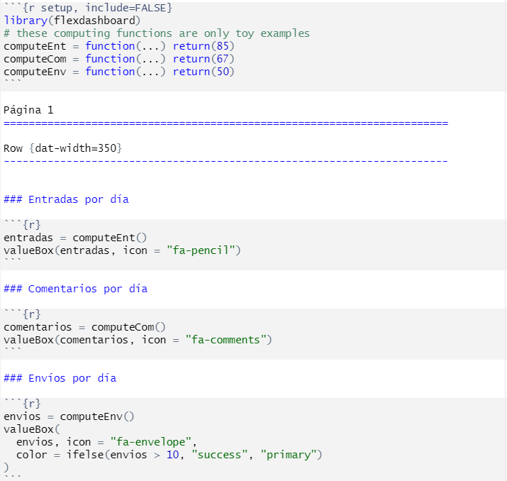

&nbsp;

```{r setup, include=FALSE}
library(learnr)
knitr::opts_chunk$set(echo = FALSE)
library(plotly)
```

## Visualización de datos con plotly

El paquete `plotly` permite conectar R con la librería gráfica de libre distribución plotly. Este paquete permite generar gráficos interactivos de calidad. La página web del paquete puede consultarse [aquí](https://plotly.com/r/).

### Ejercicio 1

Vamos a generar un diagrama de dispersión para las variables *PHQ9Sumatorio_pre* y *BDI_TOTAL_PRE* con la función `plot_ly`. Con el gráfico generado vamos a comprobar las funciones de interactividad básica:


```{r, echo=FALSE, out.width="100%",out.height="100%"}
knitr::include_graphics("images/plotlyButtons.png")
```

  * Zoom
  * Desplazamiento vertical/horizontal
  * Selección de observaciones

```{r explotlysetup}
library(haven)

PANAS <- read_sav('data/Database_PANAS.sav')

PANAS$GENDER <- car::recode(as.integer(PANAS$GENDER),paste(paste0(c("1='","2='"),names(attr(PANAS$GENDER,"labels")),"'"),collapse='; '),as.factor = TRUE)

PANAS$CIVIL_STATUS <- car::recode(as.integer(PANAS$CIVIL_STATUS),paste(paste0(c("1='","2='","3='","4='"),names(attr(PANAS$CIVIL_STATUS,"labels")),"'"),collapse='; '),as.factor = TRUE)

PANAS$EDUCATION_LEVEL <- car::recode(as.integer(PANAS$EDUCATION_LEVEL),paste(paste0(c("0='","1='","2='","3='"),names(attr(PANAS$EDUCATION_LEVEL,"labels")),"'"),collapse='; '),as.factor = TRUE)
```


```{r plotlyex1,exercise=TRUE,exercise.setup='explotlysetup',exercise.blanks='___+',warning=FALSE,message=FALSE}
plot_ly(x=___,
      y=___,
      color=___,
      data=___)
```

```{r plotlyex1-hint}
# Especifica las variables y la base de datos en su apartado
# Todas las variables van precedidas del símbolo ~
```

```{r plotlyex1-solution}
plot_ly(x=~PHQ9Sumatorio_pre,
      y=~BDI_TOTAL_PRE,
      color=~GENDER,
      data=PANAS)
```

### EJERCICIO 2

Nótese que en el ejercicio anterior no se ha especificado ningún tipo de gráfico más allá de la llamada de la función génerica y la especificación de las variables. El paquete tiene tres funciones principales:

  * Función `plot_ly`
  * Función `layout`
  * Función `add_*`: de hecho se trata de una función que añade elementos similares a los geoms de ggplot2:
  <pre style="color:blue;font-size:130%"> stringr::str_subset(objects("package:plotly"),pattern="^add_")</pre>

Vamos a realizar el gráfico que se muestra a continuación añadiendo un *pipe* (`|>`) a layout:

```{r, echo=FALSE, out.width="80%",out.height="80%"}

```

```{r plotlyex2,exercise=TRUE,exercise.setup='explotlysetup',exercise.blanks='___+',warning=FALSE,message=FALSE}
library(tidyverse)

plot_ly(x=~PHQ9Sumatorio_pre,
      y=~BDI_TOTAL_PRE,
      color=~GENDER,
      data=PANAS) |> 
  layout(     
    title = "___",  
    xaxis = list(title = "___",    
                 range = c(___, ___)),   
    yaxis = list(title = "___",   
                 range = c(___, ___))  
    )
```

```{r plotlyex2-hint}
# Especifica las cadenas de caracteres para los títulos
# Especifica los rangos numéricos para las escalas de los ejes
```

```{r plotlyex2-solution}
library(tidyverse)

plot_ly(x=~PHQ9Sumatorio_pre,
      y=~BDI_TOTAL_PRE,
      color=~GENDER,
      data=PANAS) |> 
  layout(     
    title = "PHQ9 vs BDI",  
    xaxis = list(title = "PHQ9",    
                 range = c(-5, 30)),   
    yaxis = list(title = "BDI",   
                 range = c(-5, 65))  
    )
```

### EJERCICIO 3

Utilicemos la función `add_*` para generar el siguiente gráfico:

```{r, echo=FALSE, out.width="80%",out.height="80%"}

```

```{r plotlyex3,exercise=TRUE,exercise.setup='explotlysetup',exercise.blanks='___+',warning=FALSE,message=FALSE}
PANAS |> 
  plot_ly(x = ~___, y = ~___, type = "___", name = "Scatter") |>  
  add_boxplot(name = "Boxplot")
```

```{r plotlyex3-hint}
# Especifica las variables
# Especifica el tipo scatter
```

```{r plotlyex3-solution}
PANAS |> 
  plot_ly(x = ~GENDER, y = ~BDI_TOTAL_PRE, type = "scatter", name = "Scatter") |>  
  add_boxplot(name = "Boxplot") 
```

### EJERCICIO 4

```{r, echo=FALSE, out.width="80%",out.height="80%"}

```

```{r plotlyex4,exercise=TRUE,exercise.setup='explotlysetup',exercise.blanks='___+',warning=FALSE,message=FALSE}
pal <- c('___','___')
pal <- setNames(pal,c('___','___'))

figura <- PANAS |> 
  plot_ly(
    x = ~___,
    y = ~___,
    color = ~___,
    colors = pal,
    type = '___',
    box = list(
      visible = T
    ),
    meanline = list(
      visible = T
    )
  ) 

figura <- figura  |> 
  layout(
    xaxis = list(
      title = "___"
    ),
    yaxis = list(
      title = "___",
      zeroline = F
    )
  )

figura
```

```{r plotlyex4-hint}
# Especifica la paleta con los dos colores
# Declara los nombres correspondientes a los nivels de GENDER
# Especifica el tipo scatter
```

```{r plotlyex4-solution}
pal <- c('blue','pink')
pal <- setNames(pal,c('man','woman'))

figura <- PANAS |> 
  plot_ly(
    x = ~GENDER,
    y = ~BDI_TOTAL_PRE,
    color = ~GENDER,
    colors = pal,
    type = 'violin',
    box = list(
      visible = T
    ),
    meanline = list(
      visible = T
    )
  ) 

figura <- figura  |> 
  layout(
    xaxis = list(
      title = "GENDER"
    ),
    yaxis = list(
      title = "BDI_TOTAL_PRE",
      zeroline = F
    )
  )

figura
```


### EJERCICIO 5

Existen algunas funcionalidades de reactividad gráfica adicionales implementadas en plotly, como por ejemplo, filtros mediantes barras de deslizamiento:

```{r plotlyex5,exercise=TRUE,exercise.setup='explotlysetup',exercise.blanks='___+',warning=FALSE,message=FALSE}
plot_ly(x=~PHQ9Sumatorio_pre,
      y=~BDI_TOTAL_PRE,
      color=~GENDER,
      data=PANAS) |> 
  layout(
    xaxis = list(rangeslider = list(type = "___"))
  )
```

```{r plotlyex5-hint}
# Especifica el valor x para incluir un slider en el eje x
```

```{r plotlyex5-solution}
plot_ly(x=~PHQ9Sumatorio_pre,
      y=~BDI_TOTAL_PRE,
      color=~GENDER,
      data=PANAS) |> 
  layout(
    xaxis = list(rangeslider = list(type = "x"))
  )
```

### EJERCICIO 6

Para combinar distintos gráficos en una misma ventana podemos utilizar la función `subplot`:

1) Generamos un diagrama de dispersión con los datos de PHQ9 y BDI coloreados según niveles de CIVIL_STATUS:

```{r plotlyex6,exercise=TRUE,exercise.setup='explotlysetup',exercise.blanks='___+',warning=FALSE,message=FALSE}
fig_xy <- plot_ly(
  data  = PANAS,
  x     = ~PHQ9Sumatorio_pre,
  y     = ~BDI_TOTAL_PRE,
  color = ~CIVIL_STATUS,
  type  = 'scatter',
  mode  = 'markers'
)

fig_xy
```


2) Generamos un histograma de BDI: 

```{r plotlyex6b,exercise=TRUE,exercise.setup='plotlyex6',exercise.blanks='___+',warning=FALSE,message=FALSE}
fig_y <- plot_ly(
  data       = PANAS,
  y          = ~BDI_TOTAL_PRE,
  color      = ~CIVIL_STATUS,
  type       = 'histogram',
  alpha      = 0.75,
  showlegend = FALSE,
  nbinsy     = 20,
  bingroup   = 1
) %>%
layout(
  barmode = 'overlay',
  title   = 'Histograma de BDI',
  xaxis = list(title = 'Count')
)

fig_y
```

3) Generamos un histograma de PHQ9: 

```{r plotlyex6c,exercise=TRUE,exercise.setup='plotlyex6b',exercise.blanks='___+',warning=FALSE,message=FALSE}
fig_x <- plot_ly(
  data       = PANAS,
  x          = ~PHQ9Sumatorio_pre,
  color      = ~CIVIL_STATUS,
  type       = 'histogram',
  alpha      = 0.75,
  showlegend = FALSE,
  nbinsy     = 20,
  bingroup   = 1
) %>%
layout(
  barmode = 'overlay',
  title   = 'Histograma de PHQ9',
  xaxis = list(title = 'Count')
)

fig_x
```

5) Combinamos los 3 gráficos: el diagrama dispersión en la zona central y los histogramas en los márgenes.

```{r plotlyex6d,exercise=TRUE,exercise.setup='plotlyex6c',exercise.blanks='___+',warning=FALSE,message=FALSE}
subplot(
  fig_x,
  plotly_empty(),
  fig_xy,
  fig_y,
  nrows   = 2,
  widths  = c(0.8,0.2),
  heights = c(0.2,0.8),
  shareX  = TRUE,
  shareY  = TRUE
) %>%
layout(
  title  = 'Gráfico conjunto PHQ9 y BDI'
)
```


### EJERCICIO 7

Vamos a ver ahora un gráfico más avanzado con datos geolocalizados:

1) Cargamos los datos desde una fuente externa:

```{r plotlyex7,exercise=TRUE,exercise.setup='explotlysetup',exercise.blanks='___+',warning=FALSE,message=FALSE}
#Carga de datos externos
df <- read.csv(  
  'https://raw.githubusercontent.com/plotly/datasets/master/2015_06_30_precipitation.csv'
)
```


2) Utilizamos la función `plot_geo` que permite representar datos geolocalizados:

```{r plotlyex7b,exercise=TRUE,exercise.setup='plotlyex7',exercise.blanks='___+',warning=FALSE,message=FALSE}
# Figura inicial
fig <- df |>  
  plot_geo(lat = ~Lat, lon = ~Lon)
fig
```


3) Añadimos ahora los valores correspondientes al registro de precipitaciones:

```{r plotlyex7c,exercise=TRUE,exercise.setup='plotlyex7b',exercise.blanks='___+',warning=FALSE,message=FALSE}
# Añadir valores de precipitaciones
fig <- fig |>    
  add_markers(     
    text = ~paste("Precipitación:", Globvalue)   
    ) 
fig
```


4) Configuramos ahora un poco más los marcadores:

```{r plotlyex7d,exercise=TRUE,exercise.setup='plotlyex7c',exercise.blanks='___+',warning=FALSE,message=FALSE}
# Configurar marcadores
fig <- df |>   
  plot_geo(lat = ~Lat, lon = ~Lon) |>  
  add_markers(    
    text = ~paste("Precipitación:", Globvalue),  
    color = ~Globvalue,     
    symbol = I("square"),     
    size = I(8),     
    hoverinfo = "text",   
    opacity = I(0.8)
    ) 
fig
```


5) Añadimos títulos:

```{r plotlyex7e,exercise=TRUE,exercise.setup='plotlyex7d',exercise.blanks='___+',warning=FALSE,message=FALSE}
# Títulos
fig <- fig |>   
  colorbar(title = "Precipitaciones Junio 2015") %>%   
  layout(   
    title = 'Precipitaciones en EEUU' 
    ) 
fig
```


6) Centramos el mapa en EEUU y configuramos colores:

```{r plotlyex7f,exercise=TRUE,exercise.setup='plotlyex7e',exercise.blanks='___+',warning=FALSE,message=FALSE, fig.width=7,figh.height=7}
# Configuración final
g <- list(  
  scope = 'usa',   
  projection = list(type = 'albers usa'),  
  showland = TRUE,  
  landcolor = toRGB("gray95"),  
  subunitcolor = toRGB("gray85"), 
  countrycolor = toRGB("gray85"),  
  countrywidth = 0.5,   
  subunitwidth = 0.5 
  ) 

fig <- fig |>   
  layout(  
    geo = g  
    ) 
fig
```

### EJERCICIO 8

Los gráficos originados mediante `ggplot2` pueden convertirse en interactivos gracias a la función `ggplotly`:

```{r plotlyex8,exercise=TRUE,exercise.blanks='___+',warning=FALSE,message=FALSE}
library(ggplot2)
library(dplyr)
datKendall <- read_sav("data/ExCor3.sav")

datKendall$education <- as_factor(datKendall$education)
datKendall$phase <- as_factor(datKendall$phase)

df <- datKendall %>%
  group_by(education, phase) %>%
  summarise(counts = n()) 

p <- ggplot(df, aes(x = phase, y = counts)) +
  geom_bar(
    aes(color = education, fill = education),
    stat = "identity", position = position_dodge(0.8),
    width = 0.7
    ) +
  scale_color_manual(values = c("#00AFBB", "#E7B800", "#FC4E07"))+
  scale_fill_manual(values = c("#00AFBB", "#E7B800", "#FC4E07")) + theme_bw()
p+theme(axis.text.x = element_text(size = 20),
        axis.text.y = element_text(size = 20),
        axis.title.x = element_text(size = 20),
        axis.title.y = element_text(size = 20),
        legend.text=element_text(size= 20),
        legend.title=element_text(size= 20),
        legend.position.inside = c(.2, .8))

ggplotly(___)
```

```{r plotlyex8-hint}
# Especifica el nombre del objeto ggplot creado previamente
```

```{r plotlyex8-solution}
library(ggplot2)
library(dplyr)
datKendall <- read_sav("data/ExCor3.sav")

datKendall$education <- as_factor(datKendall$education)
datKendall$phase <- as_factor(datKendall$phase)

df <- datKendall %>%
  group_by(education, phase) %>%
  summarise(counts = n()) 

p <- ggplot(df, aes(x = phase, y = counts)) +
  geom_bar(
    aes(color = education, fill = education),
    stat = "identity", position = position_dodge(0.8),
    width = 0.7
    ) +
  scale_color_manual(values = c("#00AFBB", "#E7B800", "#FC4E07"))+
  scale_fill_manual(values = c("#00AFBB", "#E7B800", "#FC4E07")) + theme_bw()
p+theme(axis.text.x = element_text(size = 20),
        axis.text.y = element_text(size = 20),
        axis.title.x = element_text(size = 20),
        axis.title.y = element_text(size = 20),
        legend.text=element_text(size= 20),
        legend.title=element_text(size= 20),
        legend.position.inside = c(.2, .8))

ggplotly(p)
```


## Visualización de datos dinámica con FlexDashboard y Shiny

### ¿QUÉ ES UN DASHBOARD?

Un dashboard o cuadro de mandos es una disposición agrupada de gráficos, cajas de valores, indicadores de rendimiento y otros elementos que permiten la rápida visualización de datos para generar conocimiento.
Son muy utilizados en los ámbitos industriales y de negocios pues posibilitan una fácil interpretación de la información en relación a los objetivos de las organizaciones.

### CARACTERÍSTICAS DE UN DASHBOARD

Algunas características que debe tener un dashboard:

  * Contener información relevante para los objetivos marcados.
  * Es eminentemente visual.
  * Está orientado a la priorización de acciones.
  * Es dinámico, actualizándose en tiempo real.
  * Ventajas de su utilización:
    - No requiere grandes conocimientos por parte de los usuarios.
    - Permite añadir múltiples fuentes de información e indicadores.
    - Posibilita el uso de múltiples usuarios.
    - Son más eficientes que los informes tradicionales.
    
### DISEÑO DE UN DASHBOARD

Al diseñar un dashboard deben tomarse una serie de decisiones, por ejemplo:

  * Problema a solventar
  * Objetivos priorizados.
  * Indicadores de consecución de objetivos.
  * Información a recoger/analizar.
  * Visualizaciones más adecuadas.
  * Elementos de interactividad.

### EL PAQUETE FLEXDASHBOARD

`flexdashboard` permite generar cuadros de mandos en RMarkdown. Puede consultarse en el siguiente [ENLACE](https://pkgs.rstudio.com/flexdashboard/).

```{r, echo=FALSE, out.width="80%",out.height="80%"}

```

Podemos generar un nuevo dashboard mediante `File > New File > R Markdown`. Marcamos la opción `From Template`. Entre las plantillas, tenemos la opción `Flex Dashboard`.
La plantilla creada presentará dos columnas y tres cajas reservadas a gráficos u otros componentes.

```{r, echo=FALSE, out.width="80%",out.height="80%"}

```

La cabecera del documento Rmd nos permite configurar parámetros globales del dashboard. Su funcionamiento es como cualquier otra cabecera *YAML* de metadatos.

```{r, echo=FALSE, out.width="90%",out.height="90%"}

```

Por defecto se da una orientación por columnas:

```{r, echo=FALSE, out.width="80%",out.height="80%"}


```

También se puede dar una orientación por filas:

```{r, echo=FALSE, out.width="80%",out.height="80%"}


```

Podemos agrupar elementos en distintas páginas:

```{r, echo=FALSE, out.width="80%",out.height="80%"}


```

Podemos añadir componentes como cajas de valores:

```{r, echo=FALSE, out.width="80%",out.height="80%"}


```

También se pueden añadir indicadores métricos (gauges):

```{r, echo=FALSE, out.width="80%",out.height="80%"}


```

flexdashboard permite añadir cajas con texto para desarrollar un *storyboard*:

```{r, echo=FALSE, out.width="80%",out.height="80%"}


```

Veremos como añadir otros componentes en nuestros dashboards, utilizando otros paquetes de R.


### EJERCICIO 1

Revisar el archivo `EjemploDB.Rmd` en la carpeta **Ejemplos DB Shiny**.

  * Inspeccionar la cabecera YAML.
  * Comprobar cómo definir la disposición por filas/columnas del dashboard.
  * Ver distintos elementos gráficos en el dashboard.
  * El entorno `` `r ` ``, ¿dónde se ha utilizado?


### EL PAQUETE SHINY

Shiny permite crear aplicaciones web de forma fácil en R (y Python).
Incluye ejemplos que pueden ser inspeccionados mediante la instrucción:

<pre style="color:blue;font-size:130%"> runExample(“NOMBRE EJEMPLO")</pre>

Puede consultarse su documentación en el siguiente [ENLACE](https://shiny.posit.co/)

Toda la aplicación estará contenida en un único archivo (app.R) con tres componentes:

  * Una interfaz de usuario (UI).
  * Una función servidor (server).
  * Una llamada a la función shinyApp().

```{r, echo=FALSE, out.width="80%",out.height="80%"}

```

Se pueden añadir distintos tipos de *widgets* de control. Consultar el siguiente [ENLACE](https://shiny.posit.co/r/gallery/widgets/widget-gallery/) para ver una muestra de estos controles.

```{r, echo=FALSE, out.width="80%",out.height="80%"}

```

### EJERCICIO 1

Revisar el archivo `EjemploShiny.R` en la carpeta **Ejemplos DB Shiny**.

  * Inspeccionar la estructura básica de una webApp de Shiny.
  * ¿Qué elementos incluye el objeto ui?
  * ¿Qué elementos incluye el objeto server?
  * Ejecutar la aplicación y comprobar reactividad.
  
```{r, echo=FALSE, out.width="80%",out.height="80%"}

```


### INTEGRACIÓN DE FLEXDASHBOARD Y SHINY


### EJERCICIO 1

Revisar el archivo `EjemploDBShiny1.Rmd` en la carpeta **Ejemplos DB Shiny**.

  * Inspeccionar la cabecera YAML.
  * Localizar *widgets* para el control de la visualización.
  * ¿Cuántos objetos reactivos podéis encontrar en el dashboard?
  * Ejecutar el DB y comprobar su reactividad.
  
### EJERCICIO 2

Revisar el archivo `EjemploDBShiny2.Rmd` en la carpeta **Ejemplos DB Shiny**.

  * Inspeccionar la cabecera YAML.
  * Localizar *widgets* para el control de la visualización.
  * ¿Cuántos objetos reactivos podéis encontrar en el dashboard?
  * Ejecutar el DB y comprobar su reactividad.
